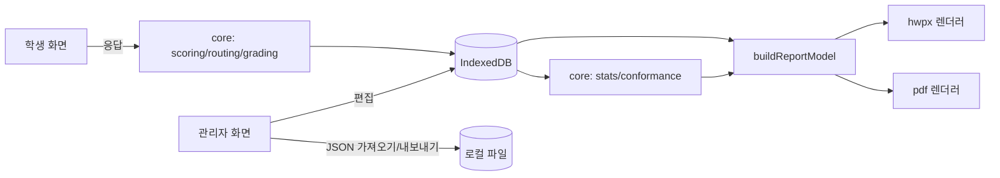

# Design Document

## 1. 개요

정적 SPA(Vite + React + TS). 서버 없음. 모든 영속 데이터는 IndexedDB(Dexie). 핵심 로직은 `src/core/`의 순수 함수로 분리해 테스트한다. 보고서는 공통 데이터 모델(`ReportModel`)을 만든 뒤 HWPX/PDF 두 렌더러로 출력한다.



## 2. 데이터 모델 (TypeScript)

```ts
type ISO = string;
type Code = string; // taxonomy code

interface Subtest {
  id: string; title: string; description: string; target: string; // 예: "고1(만 15세)"
  structure: 'single' | 'msat3';
  routing: RoutingConfig;
  gradeRule: GradeRule;
  gradeDescriptors?: { high?: string; mid?: string; low?: string };
  allowWithinUnitNav: boolean;
  createdAt: ISO; updatedAt: ISO;
}

interface Unit {               // 단위문항
  id: string; subtestId: string; unitNo: number; // 901, 902...
  title: string; scenarioIntro: string;
  passageIds: string[];
}

interface Passage {
  id: string; unitId: string; title: string;
  bodyHtml: string;            // 제한된 서식만 허용(sanitize)
  imageIds: string[];
  source: { author?: string; work?: string; publisher?: string; year?: string; pages?: string };
  situation: Code; textFormat: Code; textType: Code; organization: Code;
}

interface Item {
  id: string;                  // CR901Q01
  subtestId: string; unitId: string; order: number;
  stage: 'core' | 'stage1' | 'stage2';
  block: 'none' | 'low' | 'high'; // core는 'none'
  stem: string;                // 발문(HTML)
  // 필수 4속성
  cognitiveProcess: Code;      // 세부 코드 (대분류는 taxonomy에서 역참조)
  responseFormat: 'simple_mc' | 'complex_mc' | 'open_human' | 'short_auto';
  sourceRequirement: 'single' | 'multiple';
  difficulty: 'low' | 'mid' | 'high';
  // 형식별 페이로드
  choices?: { id: string; text: string }[]; answer?: string;            // simple_mc
  matrix?: { rows: { id: string; text: string; answer: string }[]; cols: string[]; fullCredit: 'all' | number };
  acceptedAnswers?: string[]; normalize?: { ignoreSpace: boolean; ignoreCase: boolean };
  coding?: { code: 2 | 1 | 0 | 9; criterion: string; examples: string[] }[];
  // 선택
  expectedLevel?: string; questionIntent?: string; tags?: Code[];
  commentary?: string;
}

interface RoutingConfig {
  firstCut: { high: number; mid: number };     // 정답률 비율, 기본 0.7 / 0.4
  assign: 'deterministic' | 'pisa_probabilistic';
  midGoesTo: 'low' | 'high';                   // deterministic일 때
}

interface GradeRule {
  highBlockCut: number;  // 기본 0.5
  lowBlockCut: number;   // 기본 0.7
}

interface Session {
  id: string; subtestId: string; anonCode: string;
  startedAt: ISO; submittedAt?: ISO;
  path: { stage: string; block: string; reason: string }[];
  responses: Response[];
  result?: Result;
  source: 'local' | 'imported'; importedFrom?: string;
}

interface Response {
  itemId: string; answer: unknown; timeMs: number;
  autoScore?: number;            // 자동 채점 결과
  humanCode?: 2 | 1 | 0 | 9;     // 교사 채점
}

interface Result {
  grade: 'high' | 'mid' | 'low'; provisional: boolean;
  firstJudgement: { grade: string; correct: number; total: number; rate: number };
  byProcessGroup: Record<'locate' | 'understand' | 'evaluate_reflect', { correct: number; total: number }>;
  explanation: string;
}

interface Asset { id: string; blob: Blob; mime: string; name: string } // 이미지
interface AppMeta { key: 'activeSubtestId' | 'lastBackupAt' | 'persisted'; value: string }
```

Dexie 스토어: `subtests, units, passages, items, sessions, assets, meta`. 인덱스: `items.subtestId`, `items.[subtestId+stage+block]`, `sessions.subtestId`, `sessions.anonCode`.

## 3. 핵심 알고리즘

### 3.1 자동 채점 (`scoring.ts`)
- simple_mc: 정답 일치 1, 아니면 0.
- complex_mc: `fullCredit==='all'`이면 전 행 정답일 때 1, 숫자 n이면 n행 이상 정답일 때 1.
- short_auto: 정규화 후 `acceptedAnswers` 중 하나와 일치 1.
- open_human: 자동 채점 없음(`autoScore` undefined). 득점비율 = humanCode/최고코드(9는 0).

### 3.2 경로 (`routing.ts`)
```
rate(stageItems) = Σ autoScore / count(auto-scored items)   // 구성형 제외
classify(rate, cut) = rate>=cut.high ? 'high' : rate>=cut.mid ? 'mid' : 'low'
pickBlock(cls, cfg, rng):
  deterministic: high→high, low→low, mid→cfg.midGoesTo
  pisa_probabilistic: high→(rng<.9?high:low), low→(rng<.9?low:high), mid→(rng<.5?high:low)
흐름: core 종료 → c1=classify(rate(core)) → stage1 block=pickBlock(c1)
      stage1 종료 → c2=classify(rate(core∪stage1)) → stage2 block=pickBlock(c2)
```
- `rng`는 세션 ID 시드 기반 결정적 난수(재현 가능). 경로와 판정 근거를 `session.path[].reason`에 기록.

### 3.3 등급 (`grading.ts`)
```
single 구조: grade = classify(rate(all scored), firstCut)
msat3 구조:  finalBlock = stage2 블록 수준
             r = rate(stage2 items, 구성형 채점됐으면 포함)
             finalBlock==='high' ? (r>=highBlockCut ? 'high':'mid')
                                 : (r>=lowBlockCut ? 'mid':'low')
provisional = 미채점 open_human 문항 존재
```
**전제/한계**: PISA는 IRT 척도로 능력을 추정한다. 본 규칙은 설명 가능성을 위해 단순화한 것으로, 보고서 Ⅶ에 고정 문장으로 명시한다.

### 3.4 사유 문장 (`explanation.ts`)
템플릿(변수만 치환, 자유 생성 금지):
```
첫 소검사({title})에서 '{grade}' 등급{provisional? '(잠정)':''}을 받았습니다.
그 사유는 다음과 같습니다.
① 핵심단계 {c}/{t}문항({rate}%)을 해결하여 1차로 '{g1}'(기준: 상 {hi}% 이상, 중 {mid}% 이상)으로 판정되었습니다.
② 이에 따라 {path 요약: "1단계 상 묶음 → 2단계 상 묶음"}으로 응시했고, 최종 묶음에서 {c2}/{t2}문항({r2}%)을 해결하여 기준({cut}%)에 따라 '{grade}'로 판정되었습니다.
③ 인지 과정별로는 정보 찾기 {a}/{b}, 이해하기 {c}/{d}, 평가와 성찰하기 {e}/{f}입니다.
④ 정답률이 가장 낮은 '{weakest}' 문항 유형의 보완이 필요합니다.
{gradeDescriptor 있으면: "[등급 특성] ..."}
{provisional이면: "서술형 문항 채점 후 등급이 확정됩니다."}
```
- 정답률 동률이면 문항 수가 많은 대분류를 weakest로. 해당 대분류 문항이 0개면 ③에서 생략.

### 3.5 정합성 점검 (`conformance.ts`)
Requirement 7.1 항목별 순수 함수 → `{ id, label, level: 'pass'|'warn'|'error', itemIds: string[], basis: string }[]`. `basis`에는 근거 문서 쪽수(예: "RRE 2019-11 pp.39-43")를 고정 문자열로 둔다.

### 3.6 문항 통계 (`stats.ts`)
- p = 문항 평균 득점비율.
- 변별도 = 문항 득점비율과 (총점 − 해당 문항 점수)의 피어슨 상관(교정된 문항-총점 상관). 적응형이라 응시자마다 문항 세트가 다르므로 **해당 문항을 본 학생만** 대상으로, 총점은 그 학생의 전체 득점비율로 계산. 해석 주의 문구 표시.
- 응답 시간: 평균, 중앙값, IQR.
- 선택지 분석: 선택지별 선택률, 상위/하위 27% 집단별 선택률.
- 태그 비교: 태그별 p, 변별도 평균과 문항 수.

## 4. 화면 설계

| 경로 | 화면 | 핵심 컴포넌트 |
|---|---|---|
| `#/` | 사용자 안내 → 코드 입력 | `IntroScreen`, `AnonCodeForm` |
| `#/test` | 응시 | `ScenarioIntro`, `SplitView(Passage, ItemPanel)`, `StageTransition` |
| `#/result` | 결과 | `ResultCard`(등급 배지 + 사유 문단) |
| `#/admin` | 관리자 홈(소검사 목록, 백업 경고) | `SubtestList`, `BackupBanner` |
| `#/admin/subtest/:id` | 편집기 탭: 개요 / 단위·지문 / 문항 / 채점 기준 / 연결 규칙 / 정합성 | `ItemForm`(4속성 드롭다운은 taxonomy에서 생성), `RoutingGraph` |
| `#/admin/report` | 보고서 작성 | `ReportWizard`(소검사 선택 → 형식 선택 → 진행률) |
| `#/admin/active` | 사용자 소검사 설정 | 라디오 목록 |
| `#/admin/coding` | 구성형 채점 | `CodingQueue` |
| `#/admin/pilot` | 결과 가져오기·통계 | `ImportDropzone`, `ItemStatsTable` |

- ⚙ 버튼은 `App` 레이아웃 우측 상단 고정. 관리자 라우트는 `RequireAdmin` 가드(sessionStorage 플래그).
- `ItemForm`의 인지 과정은 `<optgroup>`으로 대분류를 묶은 단일 select.

## 5. 보고서 생성

### 5.1 공통 모델
`buildReportModel(subtestId) → ReportModel { overview, frameworkTable, itemTable, itemDetails[{ id, captureBlobId, characteristics, intent, coding, commentary }], conformance, pilot?, sources, limitations }`

### 5.2 문항 캡처
화면 밖 컨테이너(`position:fixed; left:-10000px; width:900px`)에 `ItemPreview`(학생 화면과 동일 컴포넌트) 렌더 → 폰트 로드 대기(`document.fonts.ready`) → html2canvas(scale 2) → PNG Blob → assets 저장.

### 5.3 HWPX
- 템플릿: 한글에서 A4, 본문 스타일·표 스타일·제목 1~3 스타일을 정의한 빈 문서를 저장해 `public/templates/report-template.hwpx`로 둔다. 스타일 ID(charPr/paraPr/borderFill)는 `hwpx/styleMap.ts`에 상수로 기록.
- 조립 순서: 템플릿 로드(JSZip) → `Contents/section0.xml`의 본문을 생성 XML로 교체(첫 문단의 `secPr` 보존) → 이미지마다 `BinData/imageN.png` 추가, `Contents/content.hpf` 매니페스트에 항목 등록, 본문 `hp:pic`에서 참조 → 재압축.
- 패키지 규칙: `mimetype`(값 `application/hwp+zip`)은 **첫 엔트리, 비압축(STORE)**.
- 표: 문항 정보표는 11열. 셀 높이는 작게 두고 자동 확장. 열 너비 합 = 본문 폭.
- 생성 문단에 `hp:linesegarray`를 넣지 않는다.
- 검증: 한글 2020 이상에서 열어 표·이미지·한글 확인(수동). 자동 테스트는 ZIP 구조, XML 파싱 가능 여부, 이미지 참조 무결성만.

### 5.4 PDF
보고서 HTML을 A4 비율 페이지 컨테이너로 분할 렌더 → 페이지별 html2canvas → jsPDF `addImage`. 표가 페이지 경계에서 잘리지 않도록 행 단위 분할 로직.

## 6. 오류 처리
- IndexedDB 실패: 전역 오류 배너 + 내보내기 권유.
- 보고서 실패: 단계명(캡처/조립/저장)과 문항 ID를 표시.
- 가져오기 실패: 스키마 위반 필드 경로를 표시.

## 7. 테스트 전략
- `core/*` 단위 테스트: 경계값(컷 정확히 0.7), 구성형만 있는 단계(분모 0 → 해당 단계 판정 불가 처리), 확률형 시드 재현성, 사유 문장 스냅샷.
- 정합성 점검: 항목별 통과/실패 픽스처.
- 보고서: 샘플 소검사로 HWPX 생성 → ZIP 첫 엔트리·STORE 확인, content.hpf와 BinData 대응 확인.
- 수동 검수 체크리스트: 한글에서 열기, 모바일 응시, 시크릿 모드 경고.

## 8. 결정 기록
| 결정 | 대안 | 이유 |
|---|---|---|
| IndexedDB | localStorage | 이미지·용량 |
| HashRouter | BrowserRouter+404.html | 단순·안정 |
| PDF 래스터 | 폰트 임베드 jsPDF | 한글 폰트 서브셋 문제 회피, v1 단순화 |
| 템플릿 기반 HWPX | XML 전량 생성 | 스타일 정의(header.xml) 직접 작성의 호환성 위험 회피 |
| 경로 분기는 자동 채점만 | 구성형 포함 | 즉시 분기 필요 |
